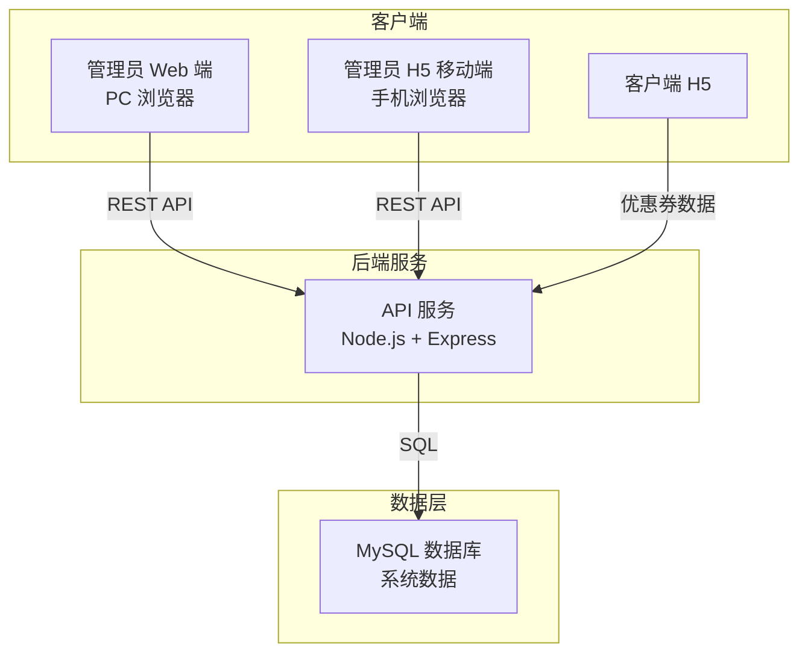
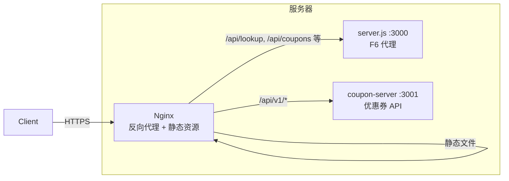
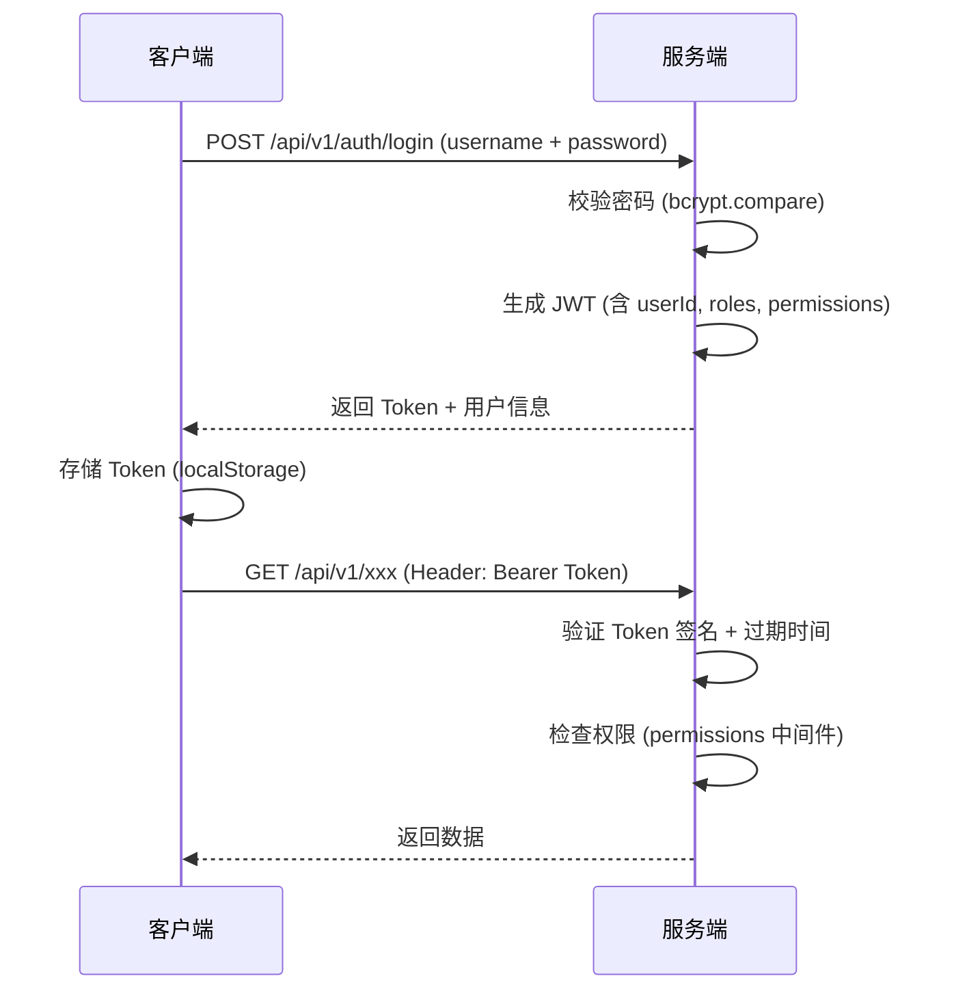

# 卡乐福优惠券系统 — 技术架构说明书

## 1. 文档说明

本文档基于 `spec/` 目录下的需求规格，结合现有项目技术栈，给出完整的技术选型与架构设计方案。

---

## 2. 系统架构总览



---

## 3. 技术选型

### 3.1 后端

| 技术 | 选型 | 说明 |
|------|------|------|
| 运行时 | **Node.js ≥ 18 LTS** | 与现有 `server.js` 技术栈一致 |
| Web 框架 | **Express 4.x** | 与现有项目一致，生态成熟 |
| ORM | **Knex.js** | 轻量级 SQL 查询构建器，支持迁移和种子数据，灵活性高 |
| 数据库 | **MySQL 8.0** | 生产环境推荐，支持事务与行锁，适合并发核销场景 |
| 认证 | **jsonwebtoken (JWT)** | 无状态 Token 认证，支持 Token 刷新 |
| 密码加密 | **bcryptjs** | 纯 JS 实现的 bcrypt，无需编译原生依赖 |
| 参数校验 | **Joi** | 声明式数据校验，适合 RESTful API 请求体/参数校验 |
| 日志 | **winston** | 分级日志，支持文件 + 控制台输出 |
| 环境变量 | **dotenv** | `.env` 文件管理敏感配置（数据库连接、JWT 密钥等） |

#### 为什么选择 Knex.js 而不是 Sequelize / Prisma？

- 项目数据模型明确且相对简单（7 张表），不需要重型 ORM
- Knex 的迁移机制足够管理数据库版本
- 原始 SQL 可控性强，方便处理并发安全的乐观锁语句（如 `WHERE status = 'unused'`）
- 与现有 Express 项目风格一致，学习成本低

#### 为什么选择 MySQL 而不是 SQLite / PostgreSQL？

- **SQLite**：无法处理并发写入，不适合多用户同时核销的生产场景
- **PostgreSQL**：能力过剩，MySQL 已足够满足需求且运维更简单
- **MySQL**：支持行级锁和事务隔离，适合优惠券核销的并发安全需求

---

### 3.2 管理员 Web 端（PC 后台）

| 技术 | 选型 | 说明 |
|------|------|------|
| 框架 | **React 18** | 组件化开发，生态丰富 |
| 构建工具 | **Vite 5** | 极速开发体验，HMR 快 |
| UI 组件库 | **Ant Design 5** | 企业级后台 UI 组件库，内置表格、表单、权限等组件 |
| 路由 | **React Router 6** | 支持嵌套路由和权限路由守卫 |
| 状态管理 | **Zustand** | 轻量级状态管理，适合中小项目 |
| HTTP 请求 | **Axios** | 与现有项目一致，支持拦截器做 Token 自动刷新 |
| 图表 | **ECharts / @ant-design/charts** | 统计看板的数据可视化 |
| 语言 | **TypeScript** | 类型安全，减少运行时错误 |

#### 为什么选择 React + Ant Design？

- Ant Design 是最成熟的**中后台 UI 框架**，内置 RBAC 权限管理所需的全部 UI 组件
- 表格（分页、筛选、搜索）、表单（校验、动态字段）、权限控制等开箱即用
- 中文文档完善，社区支持好

---

### 3.3 管理员 H5 移动端

| 技术 | 选型 | 说明 |
|------|------|------|
| 实现方式 | **原生 HTML + CSS + JavaScript** | 与现有 H5 风格一致，轻量化 |
| UI 风格 | 手动编写移动端自适应布局 | `meta viewport` + Flexbox |
| 扫码库 | **html5-qrcode** | 基于浏览器的二维码扫描，无需 App |
| HTTP 请求 | **Fetch API** | 原生支持，无需引入额外库 |
| Token 持久化 | **localStorage** | 本地存储 JWT Token |

#### 为什么选择原生开发？

- 管理员 H5 功能简单（仅登录 + 查卡 + 扫码核销），三个核心页面
- 与现有客户端 H5 保持统一的技术栈和部署方式
- 无需框架编译步骤，直接部署静态文件


## 5. 服务部署架构



### 5.1 Nginx 路由规则

| 路径 | 目标 | 说明 |
|------|------|------|
| `/` | `public/index.html` | 客户端 H5 |
| `/admin/*` | `public/admin/` | 管理员 H5 |
| `/admin-web/*` | `admin-web/dist/` | 管理员 Web 端 |
| `/api/v1/*` | `localhost:3001` | 优惠券系统 API |
| `/api/lookup`, `/api/coupons` 等 | `localhost:3000` | 现有 F6 代理 |

### 5.2 进程管理

| 工具 | 说明 |
|------|------|
| **PM2** | Node.js 进程管理，支持自动重启、日志管理、集群模式 |
| 进程 1 | `server.js`（现有 F6 代理，端口 3000） |
| 进程 2 | `coupon-server/src/app.js`（优惠券 API，端口 3001） |

---

## 6. 数据库设计

### 6.1 数据库选型：MySQL 8.0

### 6.2 表清单

| 表名 | 用途 | 关键索引 |
|------|------|----------|
| `users` | 系统管理员/员工 | `username` (UNIQUE) |
| `roles` | 角色 | `name` (UNIQUE) |
| `permissions` | 权限 | `code` (UNIQUE) |
| `user_roles` | 用户-角色关联 | 联合主键 (`user_id`, `role_id`) |
| `role_permissions` | 角色-权限关联 | 联合主键 (`role_id`, `permission_id`) |
| `customers` | 客户（消费者） | `phone` (UNIQUE), `f6_customer_id` |
| `coupon_templates` | 优惠券模板 | `status` |
| `customer_coupons` | 券实例 | `coupon_code` (UNIQUE), `customer_id + status`, `template_id` |
| `coupon_verify_logs` | 核销日志 | `coupon_id` |

### 6.3 并发安全策略

| 场景 | 方案 |
|------|------|
| 防止重复核销 | 乐观锁：`UPDATE ... SET status='used' WHERE status='unused'`，检查影响行数 |
| 防止超发 | 原子操作：`UPDATE ... SET issued_count=issued_count+1 WHERE issued_count < total_count` |
| 防止超领 | 事务 + 行锁：`SELECT COUNT(*) ... FOR UPDATE` |

---

## 7. 认证与权限方案

### 7.1 JWT 认证流程



### 7.2 Token 配置

| 参数 | 值 | 说明 |
|------|------|------|
| 算法 | HS256 | 对称签名 |
| Access Token 有效期 | 24 小时 | 适合内部管理系统 |
| Refresh Token 有效期 | 7 天 | 避免频繁登录 |
| 密钥管理 | `.env` 文件 | 不纳入版本控制 |

### 7.3 权限中间件设计

```
请求 → JWT 验证中间件 → 权限检查中间件 → 路由处理器
         ↓                    ↓
    401 Unauthorized     403 Forbidden
```

---

## 8. 与 F6 系统的集成

### 8.1 集成点

| 功能 | 调用方式 | 说明 |
|------|----------|------|
| 客户查询 | `coupon-server` →  F6 API | 通过手机号查询 F6 客户信息，建立映射 |
| 认证复用 | 读取 `.f6_auth_session.json` | 复用 `f6_auth.py` 维护的 Cookie |

### 8.2 F6 认证 Cookie 共享

`coupon-server` 复用现有 `f6_auth.py` 维护的认证 Session，通过读取 `.f6_auth_session.json` 获取 Cookie，无需独立维护 F6 登录态。

---

## 9. 核心依赖清单

### 9.1 优惠券后端 (coupon-server)

```json
{
  "dependencies": {
    "express": "^4.18.2",
    "knex": "^3.1.0",
    "mysql2": "^3.9.0",
    "jsonwebtoken": "^9.0.0",
    "bcryptjs": "^2.4.3",
    "joi": "^17.12.0",
    "winston": "^3.11.0",
    "dotenv": "^16.4.0",
    "axios": "^1.6.0",
    "cors": "^2.8.5",
    "helmet": "^7.1.0",
    "express-rate-limit": "^7.1.0"
  }
}
```

### 9.2 管理员 Web 端 (admin-web)

```json
{
  "dependencies": {
    "react": "^18.2.0",
    "react-dom": "^18.2.0",
    "react-router-dom": "^6.22.0",
    "antd": "^5.14.0",
    "@ant-design/icons": "^5.2.0",
    "@ant-design/charts": "^2.0.0",
    "axios": "^1.6.0",
    "zustand": "^4.5.0",
    "dayjs": "^1.11.0"
  },
  "devDependencies": {
    "vite": "^5.1.0",
    "@vitejs/plugin-react": "^4.2.0",
    "typescript": "^5.3.0"
  }
}
```

### 9.3 管理员 H5 / 客户端 H5

| 库 | 引入方式 | 用途 |
|------|----------|------|
| `html5-qrcode` | CDN / npm | 管理员 H5 扫码核销 |
| `qrcode.js` | CDN | 客户端 H5 券码二维码生成 |

---

## 10. 安全措施

| 层面 | 措施 |
|------|------|
| 传输 | HTTPS（Nginx 终端 SSL） |
| 密码 | bcrypt 哈希存储（cost factor = 10） |
| API 安全 | Helmet 安全头部 + CORS 白名单 |
| 速率限制 | express-rate-limit 防止暴力请求 |
| 输入校验 | Joi schema 校验所有请求参数 |
| SQL 注入 | Knex 参数化查询，杜绝拼接 SQL |
| 手机号脱敏 | 客户端 API 返回脱敏手机号（如 138****8000） |
| 摄像头权限 | 扫码功能必须在 HTTPS 环境下使用 |

---

## 11. 开发与部署流程

### 11.1 本地开发

```bash
# 1. 启动 MySQL（Docker 方式）
docker run -d --name coupon-mysql -p 3306:3306 \
  -e MYSQL_ROOT_PASSWORD=root \
  -e MYSQL_DATABASE=coupon_system \
  mysql:8.0

# 2. 启动优惠券后端
cd coupon-server
cp .env.example .env        # 配置数据库连接等
npm install
npx knex migrate:latest     # 执行数据库迁移
npx knex seed:run            # 插入初始数据
npm run dev                  # 启动开发服务器 :3001

# 3. 启动现有 F6 代理
cd ..
npm run dev                  # 启动 :3000

# 4. 启动管理员 Web 端
cd admin-web
npm install
npm run dev                  # Vite 开发服务器 :5173
```

### 11.2 生产部署

```bash
# 构建管理员 Web 端
cd admin-web && npm run build  # 产出 dist/ 目录

# PM2 启动后端服务
pm2 start server.js --name f6-proxy
pm2 start coupon-server/src/app.js --name coupon-api

# Nginx 配置反向代理
```

---

## 12. 技术风险与应对

| 风险 | 影响 | 应对措施 |
|------|------|----------|
| F6 认证 Cookie 过期 | 无法查询 F6 客户信息 | `f6_auth.py` 定时刷新 + 异常时告警 |
| 高并发核销冲突 | 重复核销 or 数据不一致 | 数据库乐观锁 + 事务隔离 |
| 移动端扫码兼容性 | 部分浏览器不支持摄像头 | 提供手动输入券码的备用方案 |
| 数据库单点故障 | 服务不可用 | MySQL 主从复制（按需） |
