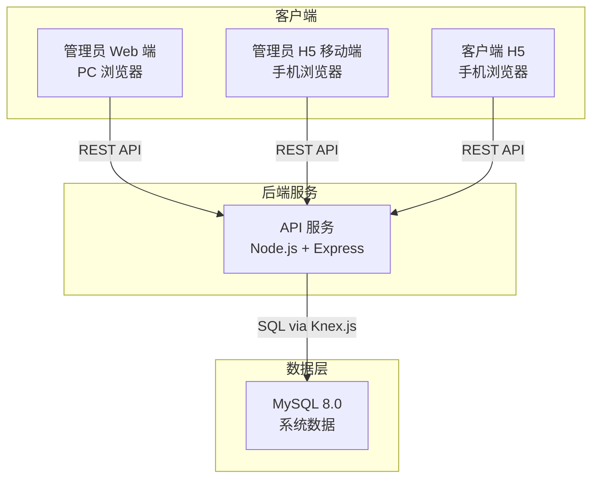
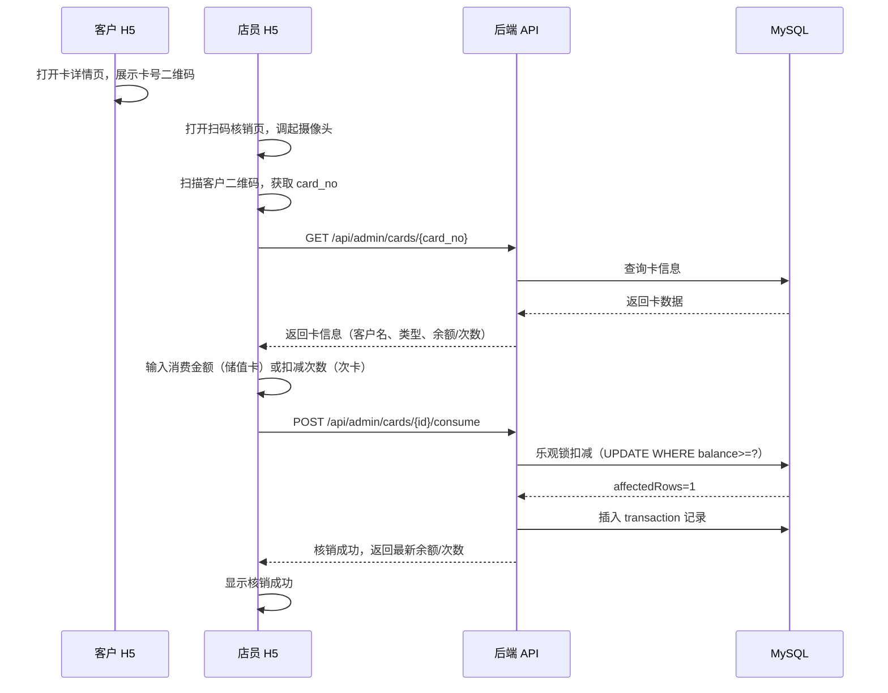
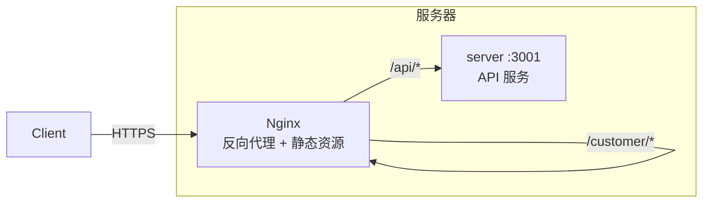

# 咖啡店发卡/消费系统 — MVP 设计文档

> 创建时间：2026-03-24
> 状态：设计中

---

## 1. 项目概述

为一家咖啡店建设简易的会员卡管理系统。系统支持两种卡类型（储值卡、次卡），由店长在线下收款后通过管理端发卡，客户通过 H5 页面查看卡余额并出示二维码供店员扫码核销。

**系统不包含线上支付功能。**

---

## 2. 核心约束

| 维度 | 决策 |
|------|------|
| 部署形态 | Web 应用（PC + 移动浏览器） |
| 储值卡规则 | 按实际金额扣减，无折扣 |
| 次卡规则 | 店长可备注用途，系统仅扣次数，不校验绑定商品 |
| 有效期 | 无，卡永久有效直到用完 |
| 核销方式 | 客户出示二维码 → 店员扫码 → 确认扣减 |
| 门店模式 | 单店，店长可添加多个店员账号 |
| 登录方式 | 手机号 + 密码（客户端 & 管理端） |
| 线上支付 | 不含 |

---

## 3. 系统架构



---

## 4. 技术选型

### 4.1 后端

| 技术 | 选型 | 说明 |
|------|------|------|
| 运行时 | Node.js ≥ 18 LTS | |
| Web 框架 | Express 4.x | |
| ORM | Knex.js | 轻量 SQL 构建器，支持迁移和种子数据 |
| 数据库 | MySQL 8.0 | 行级锁 + 事务，适合并发核销 |
| 认证 | jsonwebtoken (JWT) | 无状态 Token 认证 |
| 密码加密 | bcryptjs | |
| 参数校验 | Joi | |
| 日志 | winston | |
| 环境变量 | dotenv | |
| 安全 | helmet + cors + express-rate-limit | |

### 4.2 管理员 Web 端（PC 后台）

| 技术 | 选型 |
|------|------|
| 框架 | React 18 |
| 构建 | Vite 5 |
| UI 组件库 | Ant Design 5 |
| 路由 | React Router 6 |
| 状态管理 | Zustand |
| HTTP | Axios |
| 语言 | TypeScript |

### 4.3 管理员 H5 移动端

| 技术 | 选型 |
|------|------|
| 实现方式 | 原生 HTML + CSS + JavaScript |
| 扫码 | html5-qrcode |
| HTTP | Fetch API |
| Token 持久化 | localStorage |

### 4.4 客户端 H5

| 技术 | 选型 |
|------|------|
| 实现方式 | 原生 HTML + CSS + JavaScript |
| 二维码生成 | qrcode.js |
| HTTP | Fetch API |
| Token 持久化 | localStorage |

---

## 5. 数据库设计

### 5.1 表：`users`（管理员 & 店员）

| 字段 | 类型 | 说明 |
|------|------|------|
| id | INT, PK, AUTO_INCREMENT | 主键 |
| phone | VARCHAR(20), UNIQUE, NOT NULL | 手机号（登录用） |
| password_hash | VARCHAR(255), NOT NULL | bcrypt 密码哈希 |
| name | VARCHAR(50), NOT NULL | 姓名 |
| role | ENUM('admin', 'staff'), NOT NULL | admin=店长, staff=店员 |
| status | ENUM('active', 'disabled'), DEFAULT 'active' | 账号状态 |
| created_at | DATETIME, DEFAULT CURRENT_TIMESTAMP | 创建时间 |
| updated_at | DATETIME, ON UPDATE CURRENT_TIMESTAMP | 更新时间 |

### 5.2 表：`customers`（客户/持卡人）

| 字段 | 类型 | 说明 |
|------|------|------|
| id | INT, PK, AUTO_INCREMENT | 主键 |
| phone | VARCHAR(20), UNIQUE, NOT NULL | 手机号（登录用） |
| password_hash | VARCHAR(255), NOT NULL | bcrypt 密码哈希 |
| name | VARCHAR(50), NOT NULL | 姓名 |
| created_at | DATETIME, DEFAULT CURRENT_TIMESTAMP | 创建时间 |
| updated_at | DATETIME, ON UPDATE CURRENT_TIMESTAMP | 更新时间 |

### 5.3 表：`cards`（卡）

| 字段 | 类型 | 说明 |
|------|------|------|
| id | INT, PK, AUTO_INCREMENT | 主键 |
| card_no | VARCHAR(32), UNIQUE, NOT NULL | 卡号（系统生成，用于二维码） |
| customer_id | INT, FK → customers.id, NOT NULL | 持卡客户 |
| type | ENUM('value', 'count'), NOT NULL | value=储值卡, count=次卡 |
| balance | DECIMAL(10,2), DEFAULT 0.00 | 储值卡当前余额 |
| remaining_count | INT, DEFAULT 0 | 次卡剩余次数 |
| total_value | DECIMAL(10,2), DEFAULT 0.00 | 储值卡累计充值金额 |
| total_count | INT, DEFAULT 0 | 次卡初始总次数 |
| memo | VARCHAR(255) | 备注（如次卡用途："美式咖啡 x10"） |
| status | ENUM('active', 'exhausted', 'disabled'), DEFAULT 'active' | 卡状态 |
| issued_by | INT, FK → users.id, NOT NULL | 发卡操作人 |
| created_at | DATETIME, DEFAULT CURRENT_TIMESTAMP | 发卡时间 |
| updated_at | DATETIME, ON UPDATE CURRENT_TIMESTAMP | 更新时间 |

**索引：**
- `card_no` (UNIQUE)
- `customer_id` + `status` (复合索引，查客户的有效卡)
- `issued_by`

### 5.4 表：`transactions`（交易流水）

| 字段 | 类型 | 说明 |
|------|------|------|
| id | INT, PK, AUTO_INCREMENT | 主键 |
| card_id | INT, FK → cards.id, NOT NULL | 关联卡 |
| type | ENUM('issue', 'consume', 'recharge'), NOT NULL | 交易类型 |
| amount | DECIMAL(10,2) | 储值卡交易金额（消费为正数） |
| count | INT | 次卡交易次数（消费为正数，通常为 1） |
| balance_after | DECIMAL(10,2) | 交易后余额 |
| count_after | INT | 交易后剩余次数 |
| operator_id | INT, FK → users.id, NOT NULL | 操作人（店长/店员） |
| note | VARCHAR(255) | 操作备注 |
| created_at | DATETIME, DEFAULT CURRENT_TIMESTAMP | 操作时间 |

**索引：**
- `card_id` + `created_at` (复合索引，按卡查流水)
- `operator_id`
- `created_at`

### 5.5 并发安全策略

| 场景 | SQL 方案 |
|------|----------|
| 储值卡消费 | `UPDATE cards SET balance=balance-? WHERE id=? AND balance>=? AND status='active'`，检查 affectedRows=1 |
| 次卡消费 | `UPDATE cards SET remaining_count=remaining_count-1 WHERE id=? AND remaining_count>0 AND status='active'` |
| 耗尽标记 | 交易后检查：balance=0 或 remaining_count=0 → `UPDATE cards SET status='exhausted'` |
| 充值 | `UPDATE cards SET balance=balance+?, total_value=total_value+? WHERE id=? AND status IN ('active','exhausted')`，充值后恢复 status='active' |

---

## 6. API 设计

### 6.1 认证

| 方法 | 路径 | 说明 | 角色 |
|------|------|------|------|
| POST | `/api/auth/admin/login` | 管理员/店员登录 | 公开 |
| POST | `/api/auth/customer/login` | 客户登录 | 公开 |

### 6.2 管理端 API

| 方法 | 路径 | 说明 | 角色 |
|------|------|------|------|
| GET | `/api/admin/staff` | 查看店员列表 | admin |
| POST | `/api/admin/staff` | 添加店员 | admin |
| PATCH | `/api/admin/staff/:id/status` | 启用/禁用店员 | admin |
| GET | `/api/admin/customers` | 客户列表（分页+搜索） | admin, staff |
| POST | `/api/admin/customers` | 创建客户 | admin, staff |
| POST | `/api/admin/cards` | 发卡 | admin, staff |
| GET | `/api/admin/cards` | 卡列表（筛选） | admin, staff |
| GET | `/api/admin/cards/:cardNo` | 按卡号查卡（扫码用） | admin, staff |
| POST | `/api/admin/cards/:id/consume` | 核销消费 | admin, staff |
| POST | `/api/admin/cards/:id/recharge` | 充值 | admin, staff |
| GET | `/api/admin/transactions` | 交易记录（分页+筛选） | admin, staff |

### 6.3 客户端 API

| 方法 | 路径 | 说明 | 角色 |
|------|------|------|------|
| GET | `/api/customer/cards` | 我的卡列表 | customer |
| GET | `/api/customer/cards/:id` | 卡详情（含二维码数据） | customer |
| GET | `/api/customer/cards/:id/transactions` | 卡的消费记录 | customer |

---

## 7. MVP 功能清单

### 7.1 管理员 Web 端（PC — React + Ant Design）

| 模块 | 功能 |
|------|------|
| 登录 | 手机号 + 密码登录 |
| 店员管理 | 添加/禁用店员账号（仅 admin） |
| 客户管理 | 查看客户列表、手动创建客户 |
| 发卡 | 选客户 → 选卡类型 → 填金额/次数/备注 → 确认 |
| 卡列表 | 查看所有卡，按客户/类型/状态筛选 |
| 扫码核销 | 扫二维码 → 显示卡信息 → 输入消费金额或扣次 → 确认 |
| 充值 | 对已有储值卡追加充值 |
| 消费记录 | 查看交易流水，按时间/客户/卡号筛选 |

### 7.2 管理员 H5 移动端（3 页）

| 页面 | 功能 |
|------|------|
| 登录页 | 手机号 + 密码登录 |
| 扫码核销页 | 摄像头扫码 → 卡信息 → 输入消费 → 确认核销 |
| 最近记录 | 查看自己近期的核销操作 |

### 7.3 客户端 H5（3 页）

| 页面 | 功能 |
|------|------|
| 登录页 | 手机号 + 密码登录 |
| 卡包主页 | 展示所有持有卡的余额/次数/状态 |
| 卡详情页 | 展示二维码（供店员扫码）+ 消费记录列表 |

---

## 8. 核销操作流程



---

## 9. 项目目录结构

```
coffee/
├── docs/superpowers/specs/        # 设计文档
│
├── server/                        # 后端 API 服务
│   ├── src/
│   │   ├── app.js                 # Express 入口
│   │   ├── config/                # 配置（DB、JWT）
│   │   ├── middleware/            # 认证、权限、错误处理中间件
│   │   ├── routes/                # 路由
│   │   │   ├── auth.js            # 认证路由
│   │   │   ├── admin.js           # 管理端路由
│   │   │   └── customer.js        # 客户端路由
│   │   ├── services/              # 业务逻辑层
│   │   ├── models/                # 数据访问层（Knex 查询）
│   │   └── utils/                 # 工具函数（卡号生成等）
│   ├── migrations/                # Knex 数据库迁移
│   ├── seeds/                     # 种子数据（初始 admin 账号）
│   ├── knexfile.js
│   ├── package.json
│   └── .env.example
│
├── admin-web/                     # 管理员 Web 端（React SPA）
│   ├── src/
│   │   ├── pages/                 # 页面组件
│   │   │   ├── Login/
│   │   │   ├── StaffManage/
│   │   │   ├── CustomerManage/
│   │   │   ├── CardIssue/
│   │   │   ├── CardList/
│   │   │   ├── CardVerify/
│   │   │   ├── CardRecharge/
│   │   │   └── Transactions/
│   │   ├── components/            # 公共组件
│   │   ├── services/              # API 封装（Axios）
│   │   ├── stores/                # Zustand 状态
│   │   ├── router/                # 路由配置
│   │   ├── App.tsx
│   │   └── main.tsx
│   ├── package.json
│   └── vite.config.ts
│
├── public/                        # 静态 H5 页面
│   ├── admin/                     # 管理员 H5
│   │   ├── login.html
│   │   ├── scan.html
│   │   ├── records.html
│   │   ├── css/admin.css
│   │   └── js/
│   │       ├── admin-app.js
│   │       ├── auth.js
│   │       └── scanner.js
│   │
│   └── customer/                  # 客户端 H5
│       ├── login.html
│       ├── cards.html
│       ├── card-detail.html
│       ├── css/customer.css
│       └── js/
│           ├── customer-app.js
│           ├── auth.js
│           └── qrcode-render.js
│
└── architecture.md                # 参考技术架构文档
```

---

## 10. 部署架构



| 路径 | 目标 | 说明 |
|------|------|------|
| `/admin-web/*` | `admin-web/dist/` | 管理员 Web 端（React） |
| `/admin/*` | `public/admin/` | 管理员 H5 |
| `/customer/*` | `public/customer/` | 客户端 H5 |
| `/api/*` | `localhost:3001` | 后端 API |

进程管理：PM2

---

## 11. 安全措施

| 层面 | 措施 |
|------|------|
| 传输 | HTTPS（Nginx） |
| 密码 | bcrypt 哈希（cost=10） |
| API | Helmet + CORS 白名单 |
| 限流 | express-rate-limit |
| 输入校验 | Joi schema |
| SQL 注入 | Knex 参数化查询 |
| 手机号脱敏 | 客户端 API 返回脱敏手机号 |
| 摄像头 | HTTPS 环境下使用（浏览器要求） |

---

## 12. MVP 不做的功能

- ❌ 卡有效期
- ❌ 商品管理 / 商品绑定次卡
- ❌ 线上支付
- ❌ 多店管理
- ❌ RBAC 权限细分（固定 admin/staff/customer 三种角色）
- ❌ 数据导出
- ❌ 消息推送 / 短信通知
- ❌ 统计报表 / 图表
